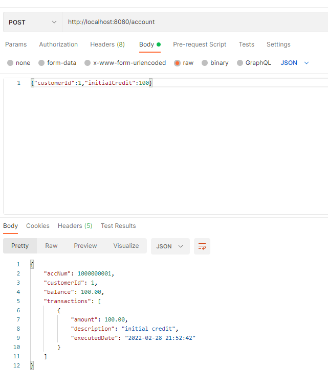
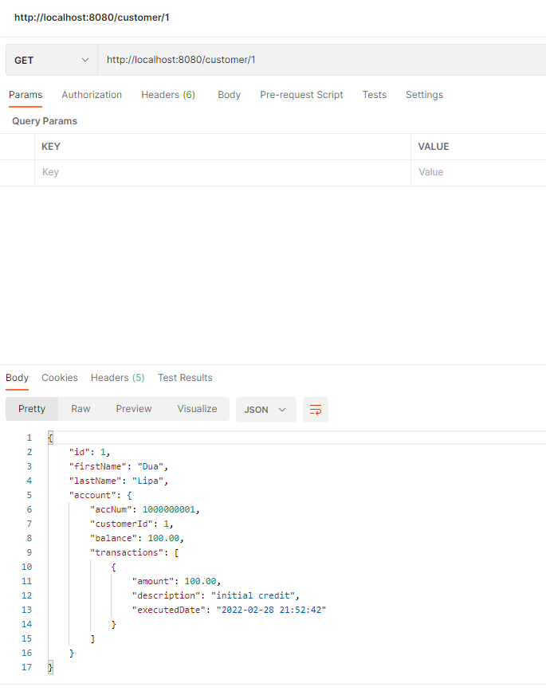
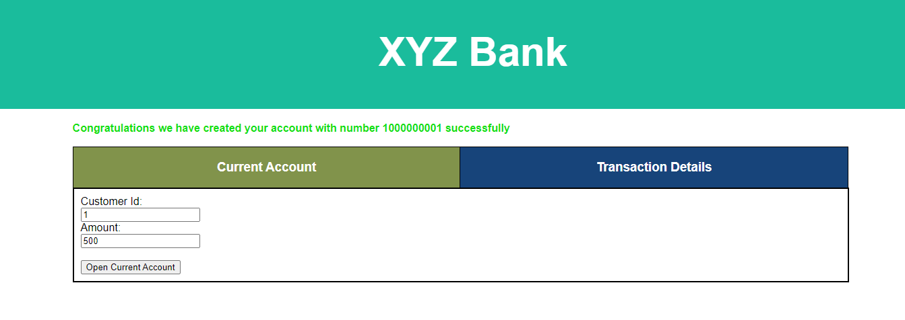
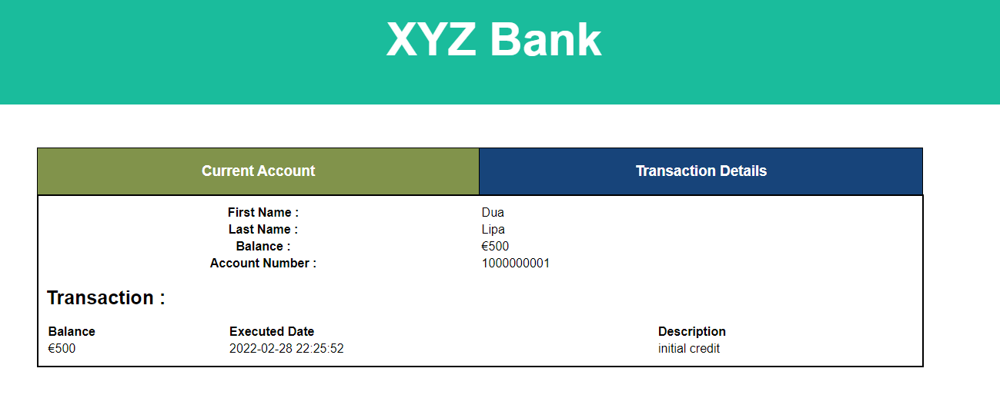

### Assignment
* created by : Shivangi Verma

##Open Current Account
A basic Java project focused on applying object-oriented design in a real world application.

##Project Aim
Provide REST API to create and view current account details for existing customers

##Technology stack
Java 8, Springboot, Lombok, H2Database, JDBC, SQL, Maven, Actuator, HTML, Javascript, jQuery, CSS

### Steps to run
* Run 'git clone ' to clone the repo.
* Run 'mvn clean install'
* Run 'java -jar target/bank-0.0.1-SNAPSHOT.jar'
* Above command Should start app on default port 8080.

**Requirements :** <br/>
Need to create two Ends points: <br/>
* One which accepts the user information (customerID, initialCredit) and once the endpoint is called, a new account will be opened connected to the user whose ID is
customerID. 
* Also, if initialCredit is not 0, a transaction will be sent to the new account.<br/>
* Another Endpoint will output the user information showing Name, Surname, balance, and transactions of the accounts.

**Prerequisites:**<br/>
Database schema is created on H2 DB using schema.SQL on application start<br/>
We have Customer id's and their details.
For Demo and test purpose have loaded below test data using Data.sql in customer table<br/>
You can access the tables once application is started with below mention URL <br/>
URL - http://localhost:8080/h2-console/login.jsp

**Test data**<br>
CUSTOMER Table

|ID |FIRSTNAME | LASTNAME 
|---|----------|----------
|1	|Dua	   |Lipa
|2	|Taylor	   |Swift
|3	|Shawn	   |Mendes
|4	|Aafje	   |Heynis

Also we have two more table called ACCOUNT (inserting user current account details) and ACCOUNT_TRANSACTION (inserting transaction details for current account)

##End point URLs details :

1) For creating current account and input parameter called customerId and initialCredit
```
POST request -
URL : http://localhost:8080/account
Body (JSON parameter):
   Example :
   URL - http://localhost:8080/account
   **Input** -
   {"customerId":1,"initialCredit":100}
   **Output** -
   {
       "accNum": 1000000001,
       "customerId": 1,
       "balance": 100.00,
       "transactions": [
                         {
                           "amount": 100.00,
                           "description": "initial credit",
                           "executedDate": "2022-02-28 21:52:42"
                         }
                       ]
   }
```


2) For fetching user information and input parameter called customerId <br />
    ```
   GET request - 
   URL : http://localhost:8080/customer/{customerId} 
   Example :
   URL - http://localhost:8080/customer/1  
   Output -
  
   {
       "id": 1,
       "firstName": "Dua",
       "lastName": "Lipa",
       "account": {
       "accNum": 1000000001,
       "customerId": 1,
       "balance": 100.00,
       "transactions": [
                        {
                           "amount": 100.00,
                           "description": "initial credit",
                           "executedDate": "2022-02-28 21:52:42"
                        }
                       ]
       }
   }
   ```
   


### Testing
Have Implemented unit Testing for business logic in Service.
Have implemented Integration tests using MockMVC.
Have ensured good coverage for Test.

###Front-end :
We have two tabs, one for creating account and other to view customer information including transactions details if any.<br/>
You can access below mention front-end URL once the application is started<br/>
URL - http://localhost:8080/index.html<br/>

###First Tab:
AIM - To open current the current account for existing customers<br/>
* Details -<br/>
Screen Contain two input fields called Customer ID (Existing customer id) and Amount(Initial credit amount) and also have "Open Current Account". On click button current account is created. 



###Second Tab:
AIM - To view user information including transactions details if any.<br/>
* Details -<br/>
Screen contain one input field called Customer ID (Existing customer id) and also have "Show Transaction" button to view user information and transaction details.


